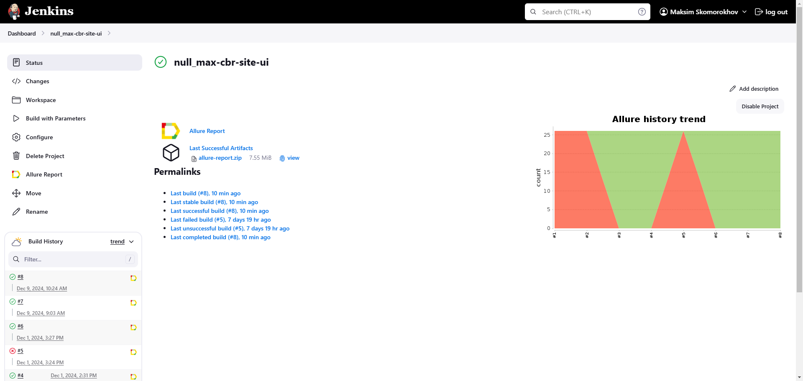
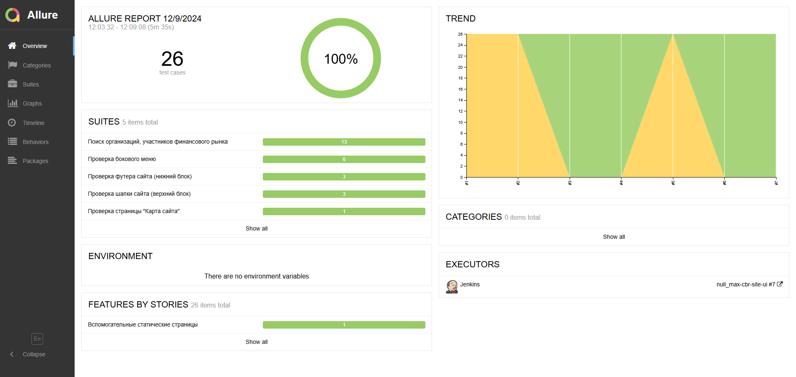
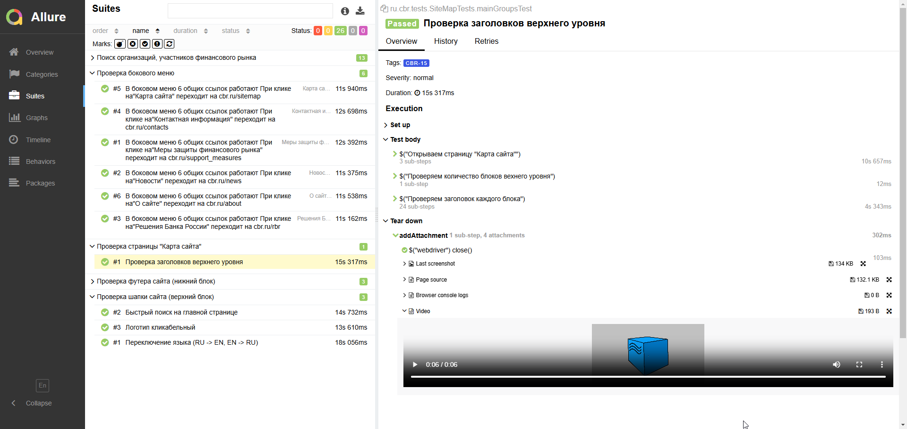
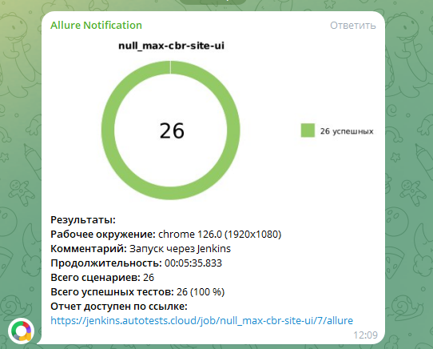

# Проект по автоматизации тестовых сценариев для сайта Центрального банка РФ
## :pushpin: Содержание:

- [Использованный стек технологий](#computer-использованный-стек-технологий)
- [Запуск автотестов](#arrow_forward-запуск-автотестов)
- [Сборка в Jenkins](#-сборка-в-jenkins)
- [Пример Allure-отчета](#-пример-allure-отчета)
- [Уведомления в Telegram с использованием бота](#-уведомления-в-telegram-с-использованием-бота)
- [Видео примера запуска тестов в Selenoid](#-видео-примера-запуска-тестов-в-selenoid)

## :computer: Использованный стек технологий

<table align="center" border="0">
    <tr>
        <td align="center"><a href="https://www.java.com/" target="_blank"></a></td>
        <td align="center"><a href="https://www.jetbrains.com/idea/" target="_blank"></a></td>
        <td align="center"><a href="https://github.com/" target="_blank"></a></td>
        <td align="center"><a href="https://gradle.org/" target="_blank"></a></td>
        <td align="center"><a href="https://junit.org/junit5/" target="_blank"></a></td>
        <td align="center"><a href="https://selenide.org/" target="_blank"></a></td>
        <td align="center"><a href="https://aerokube.com/selenoid/" target="_blank"></a></td>
        <td align="center"><a href="https://allurereport.org/" target="_blank"></a></td>
        <td align="center"><a href="https://www.jenkins.io/" target="_blank"></a></td>
        <td align="center"><a href="https://telegram.org/" target="_blank"></a></td>
    </tr>
    <tr>
        <td align="center">Java</td>
        <td align="center">IntelliJ IDEA</td>
        <td align="center">GitHub</td>
        <td align="center">Gradle</td>
        <td align="center">JUnit 5</td>
        <td align="center">Selenide</td>
        <td align="center">Selenoid</td>
        <td align="center">Allure Report</td>
        <td align="center">Jenkins</td>
        <td align="center">Telegram</td>
    </tr>
</table>

- В данном проекте автотесты написаны на языке <code>Java</code> с использованием фреймворка для тестирования Selenide. 
- В качестве сборщика был использован - <code>Gradle</code>.  
- Использованы фреймворки <code>JUnit 5</code> и [Selenide](https://selenide.org/).
- При прогоне тестов браузер запускается в [Selenoid](https://aerokube.com/selenoid/).
- Для удаленного запуска реализована джоба в <code>Jenkins</code> с формированием Allure-отчета и отправкой результатов в <code>Telegram</code> при помощи бота.

Содержание Allure-отчета:
* Шаги теста;
* Скриншот страницы на последнем шаге;
* Page Source;
* Логи браузерной консоли;
* Видео выполнения автотеста.

## :arrow_forward: Запуск автотестов

### Запуск тестов локально из терминала
При выполнении команды, данные тесты запустятся локально в IDE.
- Smoke-тесты
```
gradle clean smoke_tests
```

- Регрессионные тесты
```
gradle clean regression_tests
```


### Запуск тестов на удаленном браузере
- Smoke-тесты
```
gradle clean smoke_tests -DselenoidUrl="selenoid.autotests.cloud" -DselenoidAuth="some_login:some_password"
```

- Регрессионные тесты
```
gradle clean regression_tests -DselenoidUrl="selenoid.autotests.cloud" -DselenoidAuth="some_login:some_password"
```
При выполнении команды, данные тесты запустятся удаленно в <code>Selenoid</code>.
При необходимости также можно переопределить параметры запуска

```
clean
${TASK}
-DselenoidUrl=${SELENOID_URL}
-DselenoidAuth=${SELENOID_AUTH}
-Dbrowser=${BROWSER}
-DbrowserVersion="${BROWSER_VERSION}"
-DbrowserSize=${BROWSER_SIZE}
```

### Параметры сборки

 – .
* <code>TASK</code> – Команда запуска тестов.
* <code>BROWSER</code> – браузер, в котором будут выполняться тесты. По-умолчанию - <code>chrome</code>.
* <code>BROWSER_VERSION</code> – версия браузера, в которой будут выполняться тесты. По-умолчанию - <code>125.0</code>.
* <code>BROWSER_SIZE</code> – размер окна браузера, в котором будут выполняться тесты. По-умолчанию - <code>1920x1080</code>.
* <code>SELENOID_URL</code> – адрес удаленного сервера Selenoid, на котором будут запускаться тесты.
* <code>SELENOID_AUTH</code> – логин:пароль для доступа к удаленному серверу Selenoid.
* 

##  Сборка в Jenkins
<p align="center">

</p>

##  Пример Allure-отчета
### Overview

<p align="center">

</p>

### Результат выполнения теста

<p align="center">

</p>


##  Уведомления в Telegram с использованием бота

После завершения сборки, бот созданный в <code>Telegram</code>, автоматически обрабатывает и отправляет сообщение с результатом.

<p align="center">

</p>

##  Видео примера запуска тестов в Selenoid

К каждому тесту в отчете прилагается видео прогона.
<p align="center">
  
</p>
